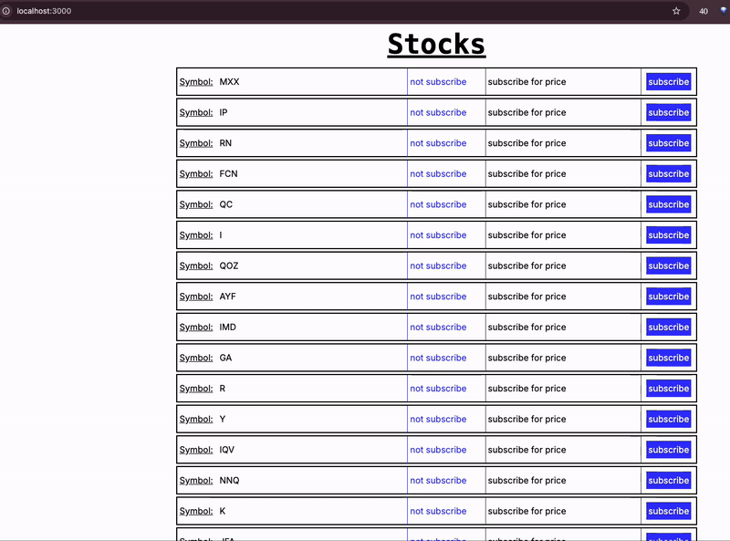

# Preview


# Full Stack Assignment: Real-Time Stock Updates

This project demonstrates real-time stock updates using WebSockets. It features a server component that sends stock updates and a Next.js client application that displays these updates.

## Project Structure

- **`/server`**: Contains the Node.js code for the WebSocket server.
- **`/src/app`**: Contains the Next.js client application that interacts with the WebSocket server.

## Getting Started

### Prerequisites

Ensure Node.js is installed on your system to run the server and client installations.

### Installation

Clone the repository, then navigate into the project directory and install the dependencies.

```bash
npm install
```

### Running the Application

**Server:**

Start the WebSocket server:

```bash
npm run server
```

**Client:**

Launch the Next.js application:

```bash
npm run dev
```

Navigate to `http://localhost:3000` to view the application.

## Functionalities

### 1. Fetch and Display Stocks

Fetch the initial list of stocks from the server and display these stocks on the screen.

### 2. Subscription Management

Allow users to subscribe to specific stock/stocks by clicking it. The subscription data should be sent to the WebSocket server in the following format:

```json
{
    "event": "subscribe",
    "stocks": [
        { "symbol": "I" }
    ]
}
```

### 3. Update UI on Stock Change

Display the subscribed stocks on the UI and update the display dynamically to reflect changes in stock prices. Use an Arrow component to indicate the direction of the stock price movement:

- **Green arrow pointing up** if the stock price increases.
- **Red arrow pointing down** if the stock price decreases.


### 4. Bonus - Extend Server Functionality

When a user subscribes to a stock, the client can optionally pass a time interval for how frequently they want updates for that specific stock. This interval should be handled dynamically on the server to adjust the rate of updates accordingly. 
Note: The client implementation is up to you - with UI components OR send the server a random number.
